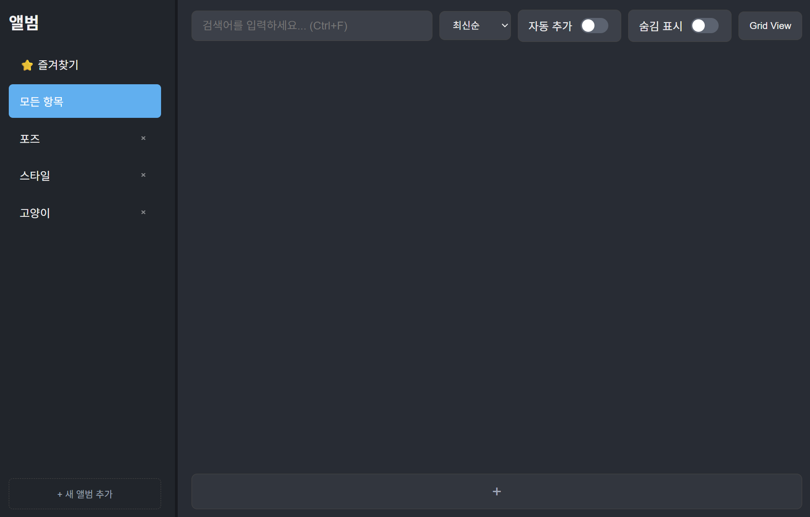

# 💡 Idea Prompt DB

AI 이미지 생성을 위한 **프롬프트 & 결과물 관리 데스크톱 애플리케이션**입니다.  
Stable Diffusion 등 다양한 AI 아트 툴을 사용하는 **아티스트와 크리에이터**를 위해 제작되었습니다.

---

## 🎥 데모 영상

- [📌 기본 사용 방법 (영상 보기)](vid/기본%20사용.mp4)
- [📌 앨범 이동 기능 (영상 보기)](vid/앨범이동.mp4)
- [📌 자동 추가 기능 (영상 보기)](vid/자동추가기능.mp4)
- [📌 서브앨범기능 (영상 보기)](vid/서브앨범.mp4)
---

## ✨ 주요 기능

- **앨범 기반 정리** : 프로젝트·주제별 앨범 생성으로 프롬프트를 깔끔하게 분류  
- **이미지 & 프롬프트 관리** : 대표 이미지 등록, 제목/프롬프트 자유 편집  
- **PNG 메타데이터 자동 추출** : 프롬프트 정보 포함 PNG 드래그 앤 드롭 → 자동 등록  
- **유연한 보기 모드** :
  - **그리드 뷰(Grid View)** : 한눈에 여러 항목 확인  
  - **리스트 뷰(List View)** : 상세 내용 바로 편집  
- **강력한 검색 및 정렬** : 제목·프롬프트 검색, 최신순/오래된순/가나다순 정렬  
-**서브폴더 (계층화)**: 앨범을 다른 앨범 안으로 드래그 앤 드롭하여 서브폴더 생성
- **편의 기능** :
  - 📋 클립보드 자동 추가
  - ✏️ 인플레이스 앨범 이름 수정
  - 📐 사이드바 너비 조절
  - ⌨️ 단축키 (`Ctrl+F` 검색, `Delete` 삭제, `ESC` 취소 등)
  - 🔔 직관적인 토스트 알림

---

## 🛠️ 기술 스택

- **프레임워크** : Electron  
- **데이터베이스** : better-sqlite3  
- **언어** : JavaScript, HTML, CSS  

---

## 🚀 설치 및 실행

1. [릴리스 탭](https://github.com/squirrel765/Idea-Prompt-DB/releases)에서 최신 `exe` 파일 다운로드
2. 실행 후 바로 사용 가능

---

## 📄 라이선스

이 프로젝트는 [MIT License](LICENSE)를 따릅니다.
